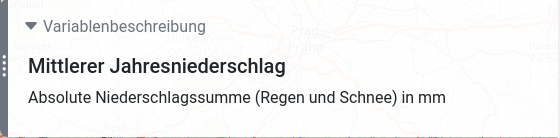

# BigData@Geo Webplattform

### API

Der Backend-Code kann [hier](https://github.com/BigDataAtGeo/BigDataAtGeo-API) gefunden werden.

## Installation

Konsole öffnen und in das Verzeichnis des Projekts wechseln, dann Abhängigkeiten installieren

```
cd code-bigdata-at-geo-webplatform
npm install
```

## Enwicklung

Generell empfiehlt es sich zur Entwicklung am Projekt die

- [Vue-Einführung](https://vuejs.org/v2/guide/)
- und den [Vue Style Guide](https://vuejs.org/v2/style-guide/)

durchzuarbeiten.

Konsole öffnen und in das Verzeichnis des Projekts wechseln, dann Server mit Live-Reloading starten.

```
npm run serve
```

## Deployment
```
npm run build
```

# Dokumentation

Folgende Abbildung zeigt grob, wie die Abhängigkeiten der Anwendung verlaufen.


### App

Enthält Willkommensnachricht mit Anleitung zur Bedienung.
Bindet außerdem das Layout für den Inhalt ein: entweder *LayoutBrowser* für Browser oder das Layout für kleinere mobile Geräte: *LayoutMobile*


### LayoutBrowser

Verantwortlich für die räumliche Komposition aller Komponenten. 
Für Browser wird im oberen Teil die *SettingsSelection* angezeigt, 
den Hintergrund bildet die *ProjectionMap*
und auf der rechten Bildschirmseite werden zusätliche Widgets angezeigt.
Letztere haben einen *WidgetShell*-Wrapper, mit dem der Inhalt der Widgets ein-/ausgeklappt werden kann.

Außerdem ist Funktionalität enthalten, um die Breite des Widget-Containers per Drag-and-Drop einzustellen.
Das ist über den eingezeichneten roten Bereich möglich.


### LayoutMobile

Verantwortlich für die räumliche Komposition aller Komponenten auf mobilen Endgeräten. Die aus dem BrowserLayout bekannten Kompenenten Widgets werden hier am unteren Bildschirmrand angezeigt, und können durch runter scrollen erreicht werden. Die Einstellungsregler können über den Knopf in der oberen Leiste aufgeklappt werden. Die *SettingsMobile* ersetzen im mobilen Layout die Funktionalität der *SettingsSelection*.


### ProjectionMap

Leaflet-basierte Karte die den gesamten Hintergrund des Fensters einnimmt.
Hier werden die Klimaprojektionen pro Koordinaten in Form von kleinen Zellen angezeigt.
Außerdem sind Icons für die Bodenfeuchtemessstationen enthalten.

Zellen und Stationen können mittels Linksklick ausgewählt werden, um weitere Informationen in anderen Widgets dazu anzuzeigen.
Durch Rechtsklick (langes Berühren bei Mobile) werden ausgewählte Zellen/Stationen aus der Auswahl entfernt und nicht ausgewählt der Auswahl hinzugefügt.


### SettingsSelection

Hier können die meisten Einstellungen getroffen werden.
Vor allem Variable, Szenario und Zeitraum der Klimaprojektion.
Außerdem kann über das Lupen-Icon nach einzelnen Orten auf der Karte gesucht werden.
Das Menü bietet als Dropdown die Optionen:
- die Willkommensnachricht erneut anzuzeigen,
- Informationen zur Datengrundlage anzuzeigen,
- das Impressum zu besuchen,
- den Datenschutz zu besuchen,
- einen Link mit den aktuellen Einstellungen zu generieren, z. B. um eine bestimmte Ansicht mit Kollegen zu teilen,
- Feeback mittels eines Kontaktformulars zu geben,
- und alle Einstellungen zurückzusetzen.


### WidgetShell

Das ist ein Wrapper, um den Inhalt von Widgets per Klick ein- und ausklappen zu können.


### InformationText

Generisches Widget, um eine Kopfzeile und dazugehörigen Text anzuzeigen.



### CellLineChart

Dieses Widget zeigt den historischen Verlauf für auf der Karte auswählte Zellen unter den aktuellen Einstellungen,
also einer Kombination aus *Variable*, *Szenario* und *Zeitraum*, in Form eines Linienplots an.


### StationLineChartCarousel

Das ist ein Wrapper, um für jede ausgewählte Station ein *StationLineChart* in Form einer Slideshow anzuzeigen.
Über die Bulletpoints am unteren Rand des Widgets können die Stationen gewechselt werden. Über den Knopf in der oberen linken Ecke des Widgets können dann einzelne Sationen wieder entfernt oder das ganze Widget geschlossen werden.

<!--  -->

### StationLineChart

Dieses Widget zeigt die Sensorinformationen einer Station an. 
Hierbei können verschiedene Sensoren beliebig kombiniert werden.
Je Station werden 2-3 Profile mit vorausgewählten Sensoren erzeugt, welche mit den jeweiligen Informationen im *StationInformation* Widget korrelieren. Die Profile beinhalten jeweils die Lufttemperatur, Niederschlag und mehrere Volumetric Water Content Sensoren.

Über die Date-Inputs unterhalb des Plots kann das Min- und Maximum der X-Achse eingestellt werden.

Die Daten werden beim Laden des Widgets dafür von der API abgefragt. 
Da verschiedene Sensor-IDs zum selben Datensatz gehören, müssen diese in der Implementierung nachträglich kombiniert werden.


### StationInformation

Diese Widget zeigt zur jeweils ausgewählten Station und dem aktuellen Profil, eine Beschreibung und Grafik zu der aktuellen Station. Diese beinhalten Informationen wie die Tiefe der Sensoren, eine Kurzbeschreibung der Bodenbeschaffenheit, ...

Dieses Widget zeigt zudem immer die Daten zu der Station und dem Profil an, welche aktuell auch im *StationLineChart* aktiv sind.


### WeatherCarousel

Das ist ebenfalls ein Wrapper, der wie *StationLineChartCarousel* mehrere *WeatherLive*-Widgets in Form einer Slideshow anzeigt.

### WeatherLive

Dieses Widget fragt die OpenWeatherMap-API ab, um zu auf der Karte ausgewählten Zellen individuell Wetterinformationen,
wie Temperatur, Luftfeuchtigkeit oder Luftdruck, anzuzeigen.


### Store

Instanz eines VueX-Stores, der die Einstellungen, wie ausgewählte Zellen/Stationen, Variable, Szenario, Zeitraum, ..., enthält.
Änderungen werden im Localstorage des Browsers gespeichert und beim nächsten Laden der Seite wiederhergestellt.
Enthält die URL beim Laden der Seite einen gültigen *?state=...*-Parameter, wird dieser stattdessen zur Initialisierung des Zustands verwendet.
Nur *SettingsSelection*, *SettingsMobile* und *ProjectionMap* und die *StationsWidgets* schreiben in den *Store*.
Andere Widgets warten auf Änderungen des Zustands und erstellen dann eine lokale Kopie davon.
Die lokale Kopie wird dann intern in den Widgets weiterverwendet.
